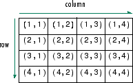
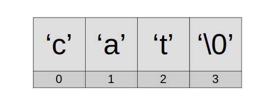

# Array

Array is a type consisting of a contiguously allocated nonempty sequence of objects with a particular element type. The number of those objects (the array size) never changes during the array lifetime.

OR,

Array is an indexed sequence of fixed number of contiguously allocated nonempty homogeneous objects under one name.

## Declaration

Before using an array, we need to declare it. In a declaration, we state the array's name, size and type.

Syntax

`type-specifier array-name[expression];`

where, `type-specifier` designates the element type (which must be a complete object type) and `expression` designates the number of elements in the array.

Examples

```c
float a[5]; // declares a float array of 5 floats
int *p[10] // declares an array of 10 pointers to ints
long int b[10]; // declares an array of 10 long ints
char s1[4]; // declares a character array of length 4

struct Student {
    char name[25];
    unsigned int rollNo;
};

struct Student students[10]; //  declares an aray of 10 Student
```

We can declare 3 different types of arrays: 

- Constant size arrays
- Variable length arrays
- Unknown size arrays

Let's see how each one is declared.

### Array of Constant Size

If expression in an array declarator is an integer constant expression with a value greater than zero and the element type is a type with a known constant size, then the declarator declares an array of constant known size.

```c
// integer constants are constant expressions
int n[10];

// enum constants are constant expressions
enum { MAX_SZ=100 };
int n[MAX_SZ];

// sizeof is a constant expression
char o[sizeof(double)];
```

### Variable Length Array (VLA)

If expression is not an integer constant expression, the declarator is for an array of variable size.

Each time the flow of control passes over the declaration, expression is evaluated and it must always evaluate to a value greater than zero), and the array is allocated. Correspondingly, lifetime of a VLA ends when the declaration goes out of scope. 

The size of each VLA instance does not change during its lifetime, but on another pass over the same code, it may be allocated with a different size.

```c
#include <stdio.h>
int main(void)
{
  int n = 1;
  do {
    int a[n]; // re-allocated 10 times, each with a different size
    printf("The array has %zu elements\n", sizeof a / sizeof *a);
  } // leaving the scope of a VLA ends its lifetime
  while (n++ < 10);
}
```

Output

```
The array has 1 elements
The array has 2 elements
The array has 3 elements
The array has 4 elements
The array has 5 elements
The array has 6 elements
The array has 7 elements
The array has 8 elements
The array has 9 elements
The array has 10 elements
```

### Array of Unknown Size

If expression in an array declarator is omitted, it declares an array of unknown size. 

```c
int x[]; // the type of x is "array of unknown bound of int"
int a[] = {1,2,3}; // the type of a is "array of 3 int"
```

The `sizeof` operator will throw an error for array`x[]`, but it will work fine with `a[]`. 

## Initialisation

Initialisation means declaring a variable and assigning value(s) to it at the same time.

We initialise arrays using brace enclosed lists `{...}`.

```c
int x[] = {1,2,3}; // x has type int[3] and holds 1,2,3
int y[5] = {1,2,3}; // y has type int[5] and holds 1,2,3,0,0
int z[3] = {0}; // z has type int[3] and holds all zeroes
```

When an array is initialised with a brace-enclosed list of initializers, the first initializer in the list initialises the array element at index zero, and each subsequent initializer initialises the array element at index one greater than the one initialised by the previous initializer.

It's an error to provide more initializers than elements when initialising an array of known size (except when initialising character arrays from string literals).

```c
int n[3] = {10, 20, 30, 40}; // error: number of characters > array size
```

## Access

* Arrays support indexed access. Elements are accessed using array name with subscripts (or indices) in square brackets `[]`. 

  Syntax: `arrayName[subscript/index]` 

  E.g. `arr[5]`

* The subscript must be an integral value or an expression that evaluates to an integral value.

* We can access any element of an array by varying the value of the subscript into the array. (To access all the elements, we may use a loop.)

* Accessing an array element is a **constant time**`O(1)` operation.

* Indexed access can be used for both peek and modify operations.

## One Dimensional Array

A one-dimensional array (or single dimension array) is a linear array, which means that its elements exist one after another in memory. Accessing its elements involves a single subscript.


As an example consider the declaration 

`int arr[10];` 

which declares a one-dimensional array named `arr` of ten integers. 

Here, the array can store ten elements of type `int` . This array has indices starting from zero through nine. For example, the expressions `arr[0]` and `arr[9]` are the first and last elements respectively.

The language specifies that array indices always begin at 0, which is why many programmers will call that element "zeroth" rather than "first".

One dimensional arrays are accessed using the same square bracket notation.

```c
int n[5] = {20, 40, 60, 80, 100};

// accessing the element at index 2
printf("%d\n", n[2]); // -> 60

// modifying the element at index 4
n[4] += 50; // {20, 40, 60, 80, 150}
```

Addressing

In a single dimension array, the element with index `i` is located at the address `B + c × i`, where `B` (base) is the address of the first element of the array and `c` (stride) a fixed constant which equals the size of the element type.

## Multi Dimensional Array

A multi-dimensional array is an array of arrays.

### 2-D Array

Each element in a two-dimensional array is an array. We can visualise it as a table or matrix where the two dimensions are rows and columns. 



Initialisation

```c
// array of 2 arrays of 3 ints each
int a[2][3] = {{1,2,3},  // can be viewed as a 2x3 matrix
               {4,5,6}}; // with row-major layout
```

Access

An element in a 2-D array is accessed using the same two brackets notation. First `[]` gives access to rows and second `[]` gives access to columns.

```c
// row 0,column 3
printf("%d\n", a[0][2]); // -> 3
    
// row 1, column 1
printf("%d\n", a[1][1]); // -> 5
```

### 3-D Array

In three dimensional arrays each element is an array and each member arrays again has multiple arrays as its members.


Initialisation

```c
// 3x3x3 cube
int b[3][3][3] = {
    {
        {1, 2, 3},
     	{4, 5, 6},
     	{7, 8, 9}
    },
    {
        {1, 2, 3},
     	{4, 5, 6},
     	{7, 8, 9}
    },
    {
        {1, 2, 3},
     	{4, 5, 6},
     	{7, 8, 9}
    }
};
```

Access

Use the same three brackets notation to access any element of the cube.

```c
// page 1, row 2, column 0 
printf("%d\n", b[1][2][0]); // -> 7
```

## Size of an Array

We can calculate the size of an array by dividing its total size in bytes with the size of the array's element type. We can use the `sizeof` operator to do so.

`sizeof(arrayName) / sizeof(data-type)` or,

`sizeof(arrayName) / sizeof(first-element)` or,

`sizeof(arrayName) / sizeof(*arrayName)`

```c
int arr[5];
int s1 = sizeof arr / sizeof int;
int s2 = sizeof arr / sizeof arr[0];
int s3 = sizeof arr / sizeof *arr;
```

## Character Array (String)

A *string literal*, written as `"A cat"`, and a character array, written as `{'A', ' ', 'c', 'a', 't'}`, are both null terminated sequences of characters. Internally both are same. They end with the null character `'\0'` so that programs can find the end. Because of null, their length in storage is one more than the number of characters.

They may be of any of the following types: `char`, `signed char`,  or `unsigned char`.



### Declaration

Declaration is the same as it is for other array types.

```c
char s1[4]; // declares a character array of length 4
```

 ### Initialisation

Character arrays can be initialised in two ways.

- **By using brace enclosed list**

  ```c
  char s[3] = {'c', 'a', 't', '\0'}; // s has type char[4] and holds c,a,t and '\0'
  ```

- **By using a string literal**

  A string literal can also be used for initialising a character array. 

  ```c
  char str[] = "abc"; // str has type char[4] and holds 'a', 'b'. 'c', '\0'
  ```

### Character Array Functions

`string.h` header has many useful functions for manipulating character arrays. It offers convenience functions for usual string operations like finding length, comparing, copying, and concatenating.

The string library is a large one, and basically, it has three types of functions:

- the `str` functions manipulate null-terminated sequences of characters;
- the `strn` functions manipulate sequences of non-null characters.
- the `mem` functions manipulate sequences of arbitrary characters without regard to the null character;

Some commonly used functions are listed here:

- `strcat` - concatenate two strings :heavy_check_mark:
- `strchr` - scans to find a particular character
- `strstr` - scans to find a sub-string
- `strcmp` - compare two strings :heavy_check_mark:
- `strcpy` - copy a string :heavy_check_mark:
- `strlen` - get string length :heavy_check_mark:
- `strncat` - concatenate one string with part of another
- `strncmp` - compare parts of two strings
- `strncpy` - copy part of a string
- `strlwr` - coverts string to lowercase
- `strupr` - coverts string to uppercase
- `strrev` - returns the reversed string

We'll see a little more about the ticked ones.

#### `strcat`

This function appends a copy of the null-terminated byte string pointed to by `src` to the end of the null-terminated byte string pointed to by `dest`. The character `src[0]` replaces the null terminator at the end of `dest`. The resulting byte string is null-terminated.

Prototype 

`char *strcat( char *dest, const char *src );`

Usage Syntax

`strcat(dst, src);`

#### `strlen`

This function returns the length of the given null-terminated byte string, that is, the number of characters in a character array whose first element is pointed to by `str` up to and not including the first null character.

Prototype 

`size_t strlen( const char *str );`

Usage Syntax

`strlen(str);`

where, `str` is  

The behavior is undefined if `str` is not a pointer to a null-terminated byte string.

#### `strcpy`

This function copies the null-terminated byte string pointed to by `src`, including the null terminator, to the character array whose first element is pointed to by `dest`

Prototype

`char *strcpy( char *dest, const char *src );`

Usage Syntax

`strcpy(dst, src);`

#### `strcmp`

This function compares two null-terminated byte strings lexicographically.

Prototype

`int strcmp( const char *lhs, const char *rhs );`

Usage Syntax

`strcmp(lhs, rhs)`

Return Value

- Negative value if `lhs` appears before `rhs` in lexicographical order.
- Zero if `lhs` and `rhs` compare equal.
- Positive value if `lhs` appears after `rhs` in lexicographical order.

## Appendix

### Integer constant expression

An integer constant expression is an expression that consists only of:

- operators other than assignment, increment, decrement, function-call, or comma, except that cast operators can only cast arithmetic types to integer types
- integer constants
- enumeration constants
- character constants
- floating constants, but only if they are immediately used as operands of casts to integer type
- `sizeof` operators whose operands are not VLA

### Designator

A designator causes the following initializer to initialise value of the array element described by the designator. Initialisation then continues forward in order, beginning with the next element after the one described by the designator.

```c
// Here n[3] is initialised with 25, rest with 0. 
int n[5] = { 0, [3] = 25 }; // -> 0 0 0 25 0
```

